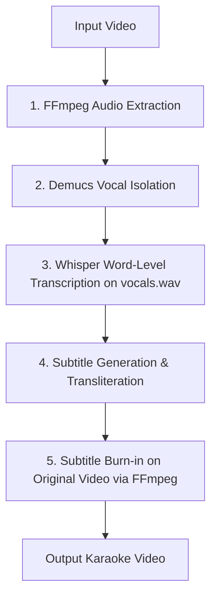

# 🎤 Karaoke Video Creator (Modular Python Pipeline)

A premium, modular Python-based utility that converts any input video into a synchronized karaoke video. It uses Demucs AI models to isolate singer vocals from instrumentals and background noise, transcribes the isolated vocals with word-level timestamps using Faster-Whisper, automatically transliterates non-Latin characters (like Tamil, Hindi, Telugu, Malayalam, and Kannada) to phonetic English letters using Aksharamukha, styles them in the ASS karaoke format, and burns the subtitles back onto the original video while preserving the original multi-instrumental audio track.

---

## 🚀 Key Features

* **Vocal Track Isolation (Demucs):** Uses Demucs (v4 htdemucs) to separate the voice track from drums, bass, guitar, piano, and other instruments. Transcription is done *only* on the isolated vocals, resulting in dramatically higher accuracy.
* **Lossless Audio & Video Preservation:** The final output video retains the original video and the original audio track (vocals + instrumentals). Subtitles are burned on top, ensuring no changes to the musical experience.
* **High-Accuracy AI Transcription:** Powered by Faster-Whisper (`large-v3`) with beam search optimization for word-level precision.
* **Multilingual Phonetic Romanization:** Automatically detects Indic scripts and converts them to standard readable English/Latin scripts (e.g. Devanagari `"मेरा नाम"` becomes `"mera naam"`, Telugu `"తెలుగు పాట"` becomes `"telugu paata"`, Tamil becomes Tanglish) using Aksharamukha and specialized transliterators.
* **Standard SubStation Alpha (ASS) Styling:** Outputs a beautifully styled subtitle file supporting the standard ASS `\k` karaoke highlight animation (text changes from white to yellow as it is sung).
* **Automated Accuracy Reporting:** Input a ground truth text file to instantly calculate standard NLP metrics, including Word Error Rate (WER), Character Error Rate (CER), and Sequence Similarity.

---

## 📊 Core Workflow



---

## 🛠️ Prerequisites

Before running the generator, ensure you have the following installed on your system:

1. **Python 3.10 or newer**
2. **FFmpeg** (Ensure it is added to your system's global environment variables/PATH)
   * **Windows (Chocolatey):** `choco install ffmpeg`
   * **macOS (Homebrew):** `brew install ffmpeg`
   * **Linux (Ubuntu/Debian):** `sudo apt install ffmpeg`

---

## 📦 Setup & Installation

1. **Navigate to the project directory:**
   ```bash
   cd karaoke-video-generator
   ```

2. **Create and activate a virtual environment (Recommended):**
   ```bash
   python -m venv venv
   # On Windows (CMD/PowerShell):
   .\venv\Scripts\activate
   # On macOS/Linux:
   source venv/bin/activate
   ```

3. **Install dependencies:**
   ```bash
   pip install -r karaoke_generator/requirements.txt
   ```

---

## 💻 How to Run

Run the coordinator module from the project root directory:

```bash
python -m karaoke_generator.main <input_video> [<output_video>] [options]
```

### Examples:

1. **Basic run (Native scripts output):**
   ```bash
   python -m karaoke_generator.main inputs/mysong.mp4 outputs/final.mp4
   ```

2. **Enable Romanization (e.g. Hindi/Tamil characters to English letters):**
   ```bash
   python -m karaoke_generator.main inputs/mysong.mp4 outputs/final.mp4 --romanize
   ```

3. **Specify language and run with reference lyrics for accuracy evaluation:**
   ```bash
   python -m karaoke_generator.main inputs/mysong.mp4 outputs/final.mp4 --language ta --romanize --lyrics lyrics/lyrics_mysong2.txt
   ```

### CLI Arguments & Options

| Argument | Description | Default |
| :--- | :--- | :--- |
| `input` | Path to the input video file (e.g., `inputs/mysong.mp4`). *(Required)* | N/A |
| `output` | Path to save the final output video. *(Optional)* | `outputs/output.mp4` |
| `--ass` | Path to save the raw generated SubStation Alpha `.ass` subtitles file. | `outputs/karaoke.ass` |
| `--language`, `-l` | Language code (e.g. `ta` for Tamil, `hi` for Hindi, `te` for Telugu, `en` for English). | Auto-detected |
| `--romanize` | Enables phonetic transliteration/romanization of Indic scripts to English letters. | `False` |
| `--vad` | Enables Voice Activity Detection (useful for speech, but disabled by default for music). | `False` |
| `--lyrics` | Path to a `.txt` file containing the ground truth lyrics. If provided, calculates accuracy metrics at the end of the run. | `None` |

---

## 📂 Project Structure

```
karaoke-video-generator/
│
├── karaoke_generator/
│   ├── __init__.py
│   ├── main.py                 # CLI Coordinator & Steps Pipeline
│   ├── vocal_separator.py      # NEW: Demucs audio vocal separation module
│   ├── transcriber.py          # Faster-Whisper transcription wrapper
│   ├── transliterator.py       # NEW: Aksharamukha & Tamil transliterator module
│   ├── subtitle_generator.py   # SubStation Alpha (ASS) karaoke generation using Transliterator
│   ├── video_processor.py      # FFmpeg wrapper (extract audio, burn captions with audio copy)
│   ├── config.py               # Custom font sizes, colors, and Whisper/Demucs default parameters
│   └── requirements.txt        # Project packages (faster-whisper, pysubs2, demucs, aksharamukha, etc.)
│
├── README.md                   # Project Documentation
└── package.json                # React Native/Web application packaging details
```

---

## 📈 Quality Assurance & Metrics

To perform accuracy validation, run the tool with the optional `--lyrics` argument pointing to a text file with the official lyrics. 

At the end of the execution, the pipeline will display a report directly in the terminal showing:
* **Sequence Similarity Ratio:** Percentage match of word alignment sequences (`difflib.SequenceMatcher`).
* **Word Error Rate (WER):** Standard NLP metric: $(Substitutions + Deletions + Insertions) / Total\_Reference\_Words$.
* **Character Error Rate (CER):** Character-level error rate.
* **Overall Word Accuracy:** $1.0 - \text{WER}$.

---

## 🎨 Subtitle Customization

You can open `karaoke_generator/config.py` to customize the karaoke presentation style:
* **`FONT_SIZE`**: Set to `14` by default for a clean, non-intrusive presentation layout.
* **`PRIMARY_COLOR`**: Style of the text *before* it is sung (Default is White `&H00FFFFFF`).
* **`SECONDARY_COLOR`**: Style of the text *as it is being sung* (Default is Yellow `&H0000FFFF`).
