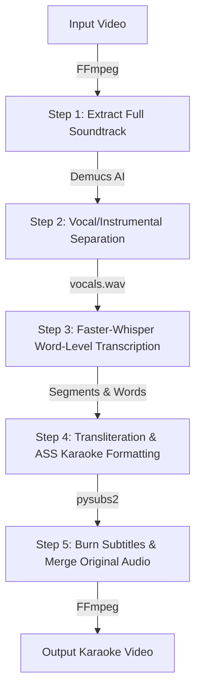

# 🎤 AI Karaoke Video Generator

A premium, production-grade Python-based utility and web service that converts any input music video into a fully synchronized, styled karaoke video. 

By isolating vocals using **Demucs AI**, transcribing them at a word level using **Faster-Whisper**, and generating romanized/phonetic transliterations for Indic scripts, the pipeline outputs beautifully timed SubStation Alpha (ASS) karaoke subtitles and burns them back onto the original video—all while keeping the original high-fidelity multi-instrumental soundtrack.

---

## 📂 Project Directory Structure

The project has been organized cleanly to separate the core Python pipeline, the REST API server, and the mobile client application:

```
karaoke-video-generator/
│
├── karaoke_generator/         # Core Python Subtitle/Video Pipeline
│   ├── __init__.py
│   ├── main.py                # Command-Line (CLI) Coordinator
│   ├── server.py              # FastAPI REST Web Server for Mobile clients
│   ├── vocal_separator.py     # Demucs audio vocal/music separation module
│   ├── transcriber.py         # Faster-Whisper wrapper with word-level timestamps
│   ├── transliterator.py      # Aksharamukha & Tamil transliterator module
│   ├── subtitle_generator.py  # SubStation Alpha (ASS) karaoke formatter
│   ├── video_processor.py     # FFmpeg wrapper (audio extraction, caption burn-in)
│   ├── config.py              # Global config variables (whisper size, fonts, colors)
│   └── requirements.txt       # Python package dependencies
│
├── lyrics/                    # Ground truth lyric files for testing
│   ├── lyrics_mysong.txt      # Correct lyrics text (for accuracy testing)
│   └── lyrics_mysong2.txt     # Sample test lyrics
│
├── inputs/                    # Input video directory
├── outputs/                   # Output folder for generated videos & subtitles
└── mobile-app/                # React Native Expo Mobile Client codebase
```

---

## 📊 Core Pipeline Workflow

The system processes video files in 5 distinct stages to guarantee maximum transcription accuracy:



### How Each Step Works:
1. **Extract Audio:** FFmpeg extracts the audio track (`temp_audio.wav`) from the input video file.
2. **Vocal Separation:** Meta's **Demucs** isolates the singer's vocals from the background music. The separation ensures that piano, drums, guitar, and other backing tracks do not degrade the accuracy of the speech-to-text engine.
3. **Word-Level Transcription:** **Faster-Whisper** transcribes only the clean isolated vocal file (`vocals.wav`), returning exact timestamp boundaries for every individual word.
4. **Transliteration & Formatting:** Indic languages are detected and automatically transliterated to Latin characters (Tanglish, Hinglish, etc.). SubStation Alpha (ASS) files are generated with custom time codes (`\k` tags) representing the exact duration of each syllable/word.
5. **Caption Burn-in:** FFmpeg overlays the ASS subtitle file on top of the original video stream, re-attaching the original full stereo soundtrack (vocals + instruments) so the musical experience remains untouched.

---

## 📦 Required Python Libraries

All required dependencies are defined in [requirements.txt](file:///c:/Users/janas/Documents/GitHub/karaoke-video-generator/karaoke-video-generator/karaoke_generator/requirements.txt). Below is a breakdown of what each library does and why it was chosen:

| Library | Purpose & Rationale |
| :--- | :--- |
| **`faster-whisper`** | Executes state-of-the-art speech-to-text with extreme speed and GPU/CPU efficiency using CTranslate2. Used to detect word-level timestamps. |
| **`demucs`** | Meta's deep-learning model for music source separation. It isolates vocals from backing music, solving the issue of low transcription accuracy on vocal tracks mixed with heavy instruments. |
| **`pysubs2`** | A Python library for subtitle editing. Used to construct the complex timing formats and metadata required for SubStation Alpha (`.ass`) karaoke subtitles. |
| **`ffmpeg-python`** | Programmatic binding for FFmpeg. Allows python to invoke complex audio-extraction and subtitle-burning commands safely. |
| **`aksharamukha`** | Transliterator tool used to convert Indic scripts (Tamil, Hindi, Telugu, Malayalam, Kannada) into standard Roman characters. |
| **`tamil-translite`** | Specialized wrapper targeting the Tamil script to ensure natural-sounding transliterated Tanglish. |
| **`anyascii`** | Handles Unicode-to-ASCII conversion, sanitizing and cleaning special characters for subtitle rendering. |
| **`torchcodec`** | Provides high-performance decoding for audio streams, speeding up initial data loading. |
| **`fastapi`** | Lightweight, high-performance web framework used to expose the generator pipeline as a REST API for the mobile application. |
| **`uvicorn[standard]`** | Production-grade ASGI server used to host and serve the FastAPI application. |
| **`python-multipart`** | Enables the FastAPI server to receive and process binary files (such as MP4 video uploads) from the React Native app. |

---

## 🛠️ Installation & Setup

1. **Clone & Navigate to the Project:**
   ```bash
   cd karaoke-video-generator
   ```

2. **Create and Activate a Virtual Environment:**
   ```bash
   python -m venv venv
   # On Windows:
   .\venv\Scripts\activate
   # On macOS/Linux:
   source venv/bin/activate
   ```

3. **Install Dependencies:**
   ```bash
   pip install -r karaoke_generator/requirements.txt
   ```

4. **Verify FFmpeg Installation:**
   Make sure you have FFmpeg installed on your system PATH. Test with:
   ```bash
   ffmpeg -version
   ```

---

## 💻 Running the CLI Tool

Run the coordinator module directly from the root of the project:

```bash
python -m karaoke_generator.main <input_video> [<output_video>] [options]
```

### Examples:

1. **Standard Run (Automatic Tanglish/Romanization):**
   ```bash
   python -m karaoke_generator.main inputs/mysong.mp4 outputs/final.mp4
   ```

2. **Disable Romanization (Outputs native script like Tamil/Hindi characters):**
   ```bash
   python -m karaoke_generator.main inputs/mysong.mp4 outputs/final.mp4 --no-romanize
   ```

3. **Force a Specific Language (e.g. Tamil):**
   ```bash
   python -m karaoke_generator.main inputs/mysong.mp4 outputs/final.mp4 --language ta
   ```

4. **Run Transcription with VAD (Voice Activity Detection) Filter Enabled:**
   ```bash
   python -m karaoke_generator.main inputs/mysong.mp4 outputs/final.mp4 --vad
   ```

---

## 📈 Quality Assurance & Accuracy Testing

To measure performance improvement and transcription quality, you can evaluate the generated text against a ground-truth lyrics text file.

### Running a Test:
```bash
python -m karaoke_generator.main inputs/mysong.mp4 outputs/output_vocal_separated.mp4 --lyrics lyrics/lyrics_mysong.txt
```

### The Output Report:
At the end of processing, the terminal will print a **Lyrics Accuracy Metrics Report**:
* **Sequence Similarity Ratio:** Match percentage calculated via SequenceMatcher algorithms.
* **Word Error Rate (WER):** Percentage of word insertions, deletions, and substitutions.
* **Character Error Rate (CER):** Character-level typo evaluation.
* **Overall Word Accuracy:** Final accuracy score ($1.0 - \text{WER}$).

---

## 📱 Running the Web Server for the Mobile App

To connect the React Native mobile app (running via Expo Go) to the Python pipeline, you need to spin up the web backend:

1. **Start the FastAPI Server:**
   ```bash
   python -m karaoke_generator.server
   ```
   *The server will start listening on `http://0.0.0.0:8000`.*

2. **Configure your Mobile App:**
   * Find your PC's local network IP address (e.g., `192.168.1.40`).
   * Open [api.ts](file:///c:/Users/janas/Documents/GitHub/karaoke-video-generator/karaoke-video-generator/mobile-app/services/api.ts) in the `mobile-app` directory and update the `API_BASE_URL`:
     ```typescript
     export const API_BASE_URL = 'http://<YOUR_PC_IP>:8000';
     ```

3. **Server API Endpoints:**
   * `POST /upload` - Receive uploaded video file from device.
   * `GET /status/{jobId}` - Poll status updates (`queued` ➔ `extracting` ➔ `separating` ➔ `transcribing` ➔ `done`).
   * `GET /output/{jobId}` - Download the completed karaoke video (supports on-demand quality and format transcoding).

---

## 🎨 Configuration & Customization

Open [config.py](file:///c:/Users/janas/Documents/GitHub/karaoke-video-generator/karaoke-video-generator/karaoke_generator/config.py) to edit global constants:
* **Font Styles:** Adjust `FONT_SIZE` (default is `14` for clean subtitle appearance), margins, and fonts.
* **Colors:** Customize `PRIMARY_COLOR` (color of text before it is sung) and `SECONDARY_COLOR` (color of text highlight animation as it is sung).
* **Whisper Model:** Swap Whisper model sizes (e.g., change from `large-v3` to `base` or `small` for faster CPU processing).
