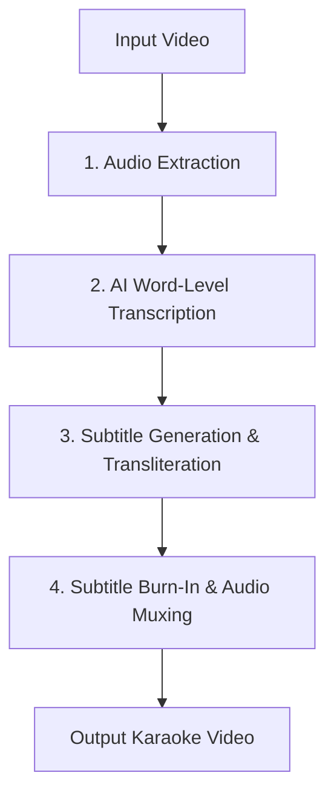

# 🎤 Karaoke Video Creator (Modular Python Pipeline)

A premium, modular Python-based utility that converts any input video into a synchronized karaoke video. It uses AI models to extract speech, transcribes the lyrics with word-level timestamps, automatically transliterates non-Latin characters (like Tamil to phonetic Tanglish), styles them in the ASS karaoke format, and burns the subtitles back onto the original video while preserving the audio track.

---

## 🚀 Key Features

* **High-Accuracy AI Transcription:** Powered by Faster-Whisper (`large-v3`) for word-level precision.
* **Smart Transliteration (Tanglish/ASCII):** Automatically detects non-Latin scripts (like Tamil) and converts them phonetically to English characters (e.g. `"தமிழ்"` becomes `"thamizh"`) using specialized Indic libraries, with standard ASCII fallback.
* **Lossless Audio Preservation:** Retains the original audio quality (`acodec='copy'`) without any compression loss.
* **VAD Optimization for Music:** Voice Activity Detection (VAD) is disabled by default to prevent filtering out sustained singing notes, quiet vocal overlays, or whispered lyrics.
* **Standard SubStation Alpha (ASS) Styling:** Outputs a beautifully styled subtitle file supporting the standard ASS `\k` karaoke highlight animation (text changes from white to yellow as it is sung).
* **Automated Accuracy Reporting:** Input a ground truth text file to instantly calculate standard NLP metrics, including Word Error Rate (WER) and Sequence Similarity.

---

## 📊 Core Workflow



---

## 🛠️ Prerequisites

Before running the generator, ensure you have the following installed on your system:

1. **Python 3.10 or newer**
2. **FFmpeg** (Ensure it is added to your system's global environment variables/PATH)
   * **Windows (Chocolatey):** `choco install ffmpeg`
   * **macOS (Homebrew):** `brew install ffmpeg`
   * **Linux (Ubuntu/Debian):** `sudo apt install ffmpeg`

---

## 📦 Setup & Installation

1. **Navigate to the project directory:**
   ```bash
   cd karaoke-video-generator
   ```

2. **Create and activate a virtual environment (Recommended):**
   ```bash
   python -m venv venv
   # On Windows (CMD/PowerShell):
   .\venv\Scripts\activate
   # On macOS/Linux:
   source venv/bin/activate
   ```

3. **Install dependencies:**
   ```bash
   pip install -r karaoke_generator/requirements.txt
   ```

---

## 💻 How to Run

Run the coordinator module from the project root directory:

```bash
python -m karaoke_generator.main <input_video> [<output_video>] [options]
```

To run a test with automated accuracy evaluation:
```bash
python -m karaoke_generator.main inputs/mysong.mp4 outputs/output_tested.mp4 --lyrics lyrics/test_lyrics.txt
```

### CLI Arguments & Options

| Argument | Description | Default |
| :--- | :--- | :--- |
| `input` | Path to the input video file (e.g., `inputs/mysong.mp4`). *(Required)* | N/A |
| `output` | Path to save the final output video. *(Optional)* | `outputs/output.mp4` |
| `--ass` | Path to save the raw generated SubStation Alpha `.ass` subtitles file. | `outputs/karaoke.ass` |
| `--language`, `-l` | Language code (e.g. `ta` for Tamil, `hi` for Hindi, `en` for English). | Auto-detected |
| `--no-romanize` | Disables phonetic transliteration. Lyrics will remain in native scripts. | Romanization is active |
| `--vad` | Enables Voice Activity Detection (useful for speech, but disabled by default for music). | `False` |
| `--lyrics` | Path to a `.txt` file containing the ground truth lyrics. If provided, calculates accuracy metrics at the end of the run. | `None` |

---

## 📈 Quality Assurance & Metrics

To perform a product-release validation on transcription accuracy, run the tool with the optional `--lyrics` argument pointing to a text file with the official lyrics:

```bash
python -m karaoke_generator.main inputs/mysong.mp4 outputs/output_tested.mp4 --lyrics lyrics/real_lyrics.txt
```

*(Note: The `--lyrics` file is completely optional. If you do not provide this argument, the video will still be generated normally, and the accuracy calculation/metrics report will be skipped).*

At the end of the execution, the pipeline will display a report directly in the terminal showing:
* **Sequence Similarity Ratio:** Percentage match of word alignment sequences (`difflib.SequenceMatcher`).
* **Word Error Rate (WER):** Standard NLP metric: $(Substitutions + Deletions + Insertions) / Total\_Reference\_Words$.
* **Overall Word Accuracy:** $1.0 - \text{WER}$.

*(The system automatically detects if the reference file contains native script (Tamil/Hindi) or Romanized text (English letters), and matches it against the correct transcription format).*

---

## 📂 Project Structure

```
karaoke-video-generator/
│
├── karaoke_generator/
│   ├── __init__.py
│   ├── main.py                 # CLI Coordinator & Steps Pipeline
│   ├── transcriber.py          # Faster-Whisper transcription wrapper
│   ├── subtitle_generator.py   # SubStation Alpha (ASS) karaoke generation & transliterators
│   ├── video_processor.py      # FFmpeg wrapper (extract audio, burn captions with audio map)
│   ├── config.py               # Custom font sizes, colors (&HAABBGGRR format), and Whisper defaults
│   └── requirements.txt        # Project packages (faster-whisper, pysubs2, ffmpeg-python, anyascii, tamil-translite)
│
├── README.md                   # Project Documentation
└── package.json                # (Optional) Node/Vite developer portal structure
```

---

## 🎨 Subtitle Customization

You can open `karaoke_generator/config.py` to customize the karaoke presentation style:

* **`FONT_SIZE`**: Set to `14` by default for a clean, non-intrusive presentation layout.
* **`PRIMARY_COLOR`**: Style of the text *before* it is sung (Default is White `&H00FFFFFF`).
* **`SECONDARY_COLOR`**: Style of the text *as it is being sung* (Default is Yellow `&H0000FFFF`).
